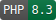

# Entra





Easily sign-in and poll users and groups in Microsoft Entra, built using [Laravel Microsoft Graph](https://github.com/dcblogdev/laravel-microsoft-graph). 

## Setup

1. Install this library using `Composer`:
   ```bash
   composer require networkrailbusinesssystems/entra
   ```
2. Publish the Entra configuration file using `Artisan`:
   ```bash
   php artisan vendor:publish --tag="entra"
   ```
3. Publish the MsGraph configuration file
   ```bash
   php artisan vendor:publish --provider="Dcblogdev\MsGraph\MsGraphServiceProvider" --tag="config"
   ```
   * You generally only need to set the `scopes` property
   * More information is available in the [Laravel Microsoft Graph](https://github.com/dcblogdev/laravel-microsoft-graph) documentation
4. Publish the MsGraph migration file
   ```bash
   php artisan vendor:publish --provider="Dcblogdev\MsGraph\MsGraphServiceProvider" --tag="migrations"
   ```
   * Consider adding a foreign key to the `user_id` column for greater efficiency
5. Adjust the `entra.php` configuration file to suit your needs
6. Setup your authenticatable User model
   * Implement the `EntraAuthenticatable` interface on your chosen Model
   * Add the `AuthenticatesWithEntra` trait on your chosen Model for a standard fetch and sync setup, or implement the methods yourself
7. Add the Entra authentication routes to your `routes/web.php` using the macro:
   ```php
   Route::entra();
   
   Route::middleware('MsGraphAuthenticated')->group(function () {
       // Your authenticated routes here...
   }
   ```

## Configuration

### create_users

Whether to allow Users without an account in the system already to sign-in.

When set to `true`, Entra will automatically create a new User record for anyone who successfully signs in.

When set to `false`, Users must be manually added before they can sign-in, even with a valid SSO session.

### messages

Customise any of the error messages thrown by Entra.

| Key           | Usage                                                                                  |
|---------------|----------------------------------------------------------------------------------------|
| existing_only | Shown when a new User attempts to log into a system with `create_users` set to `false` |


### sync_attributes

Any attributes set here will automatically be filled when signing in, keeping the User up to date with any changes in Entra.

The array should contain a key-value pair in `entra => laravel` format.

```php
'sync_attributes' => [
    'mail' => 'email',
],
```

### user_model

The fully qualified class name of the Model used for Laravel authentication.

```php
use App/Models/User;

'user_model' => User::class,
```

### emulator

These attributes controls the Entra emulator, and the mock data available to it.

See the "Emulator" section further on for more information.

## Signing in and out

Users will automatically be redirected to the Microsoft Azure login page whenever they attempt to access an authenticated route as a guest.

The `EntraServiceProvider` automatically registers the relevant event listeners for authentication.

### Automatic

If you wrap all of your system's endpoints in the `MsGraphAuthenticated` middleware, Users will be automatically kicked to the Entra login page.

Should they become signed out for whatever reason, they will be kicked to the Entra login screen.

This may or may not be desirable based on how much of the system should be available to non-users.

### Manual sign-in and out

You can allow users to manually login by providing a link to the `login` route, which will take them to the Entra login page.

Users can logout by calling the `logout` route, which will take them to the Entra logout page.

## Querying Entra

You can use the `Laravel Microsoft Graph` library as normal.

Entra queries on routes outside of the `MsGraphAuthenticated` middleware must connect to Entra first, otherwise the request will hit a 302 redirect and fail.

### MsGraph

A drop-in alias for the `MsGraph` facade has been provided which adds docblocks for IDE support.

### EntraGroup

#### Get

Search for and return a specific group.

| Parameter | Type   | Default | Usage                                  |
|-----------|--------|---------|----------------------------------------|
| $term     | string |         | A unique string to find the group by   |
| $field    | string | mail    | Which field to look for the `$term` in |
| $select   | ?array | []      | Which fields to return                 |
| :returns  | ?array |         | The group as an array, or null         |

#### List

Search for groups which start with a term.

| Parameter | Type   | Default | Usage                                  |
|-----------|--------|---------|----------------------------------------|
| $term     | string |         | A unique string to find the group by   |
| $field    | string | mail    | Which field to look for the `$term` in |
| $limit    | int    | 10      | How many results to show               |
| $select   | ?array | []      | Which fields to return                 |
| :returns  | array  |         | An array of groups                     |

### EntraGroupMembers

#### Get

Retrieve a list of users for a group by the group's ID.

Entra will be polled until all of the group's users have been loaded.

| Parameter | Type   | Default  | Usage                                    |
|-----------|--------|----------|------------------------------------------|
| $term     | string |          | A unique string to find the group by     |
| $field    | string | mail     | Which field to look for the `$term` in   |
| $select   | ?array | ['mail'] | Which fields to return                   |
| :returns  | ?array |          | The group's members as an array, or null |

### EntraUser

#### Get

Search for and return a specific user.

| Parameter | Type   | Default                       | Usage                                  |
|-----------|--------|-------------------------------|----------------------------------------|
| $term     | string |                               | A unique string to find the user by    |
| $field    | string | mail                          | Which field to look for the `$term` in |
| $select   | ?array | config(entra.sync_attributes) | Which fields to return                 |
| :returns  | ?array |                               | The user as an array, or null          |

#### List

Search for users which start with a term.

| Parameter | Type   | Default                       | Usage                                  |
|-----------|--------|-------------------------------|----------------------------------------|
| $term     | string |                               | A unique string to find the user by    |
| $field    | string | mail                          | Which field to look for the `$term` in |
| $limit    | int    | 10                            | How many results to show               |
| $select   | ?array | config(entra.sync_attributes) | Which fields to return                 |
| :returns  | array  |                               | An array of users                      |

#### Import

Search for and import a specific user to the database.

If the user already exists they will be updated.

| Parameter | Type                  | Default                       | Usage                                  |
|-----------|-----------------------|-------------------------------|----------------------------------------|
| $term     | string                |                               | A unique string to find the user by    |
| $field    | string                | mail                          | Which field to look for the `$term` in |
| $select   | ?array                | config(entra.sync_attributes) | Which fields to return                 |
| :returns  | ?EntraAuthenticatable |                               | The user model, or null                |

## Rules

### UserExistsInEntra

Ensure that the given User exists in Entra.

```php
// Request data
[
    'email' => 'joe.bloggs@networkrail.co.uk',
];

// FormRequest rules()
'email' => [
    new UserExistsInEntra('mail'),
];
```

You may provide the field to match the value to as the first parameter of the Rule.

## Emulator

It is unlikely that your unit tests will ever be connected to a live Entra instance.

You can mock `MsGraph` for specific calls, however you may prefer to re-use a defined list of results.

The emulator only works with the models provided by this library.

Setting `entra.emulator.enabled = true` in your config will enable the emulator.

You may also use the `AssertsEntra` trait on your base `TestCase` class to make the `useEntraEmulator()` method available in your tests.

Emulation does not support signing in or out.

### EntraGroup and EntraGroupMembers

Defining a list of `groups` on the `entra.emulator.groups` key will allow you to create a custom list of groups with members which you can re-use.

Performing an `EntraGroup::get` will return a matching group from the list.

Performing an `EntraGroup::list` will return a matching set of results from the list.

Performing an `EntraGroupMembers::get` will return a matching group's members from the list.

### EntraUser

Defining a list of `users` on the `entra.emulator.users` key will allow you to create a custom list of users which you can re-use.

Performing an `EntraUser::get` or `EntraUser::import` will return a matching user from the list.

Performing an `EntraUser::list` will return a matching set of results from the list.

### Sample Entra responses

Sample responses are provided on the relevant EntraModel.

## Roadmap

* Add 302 handler to MsGraph facade
* Managed Identities for jobs / CLI
* Specific connect exception handlers

## Help and support

You are welcome to raise any issues or questions on GitHub.

If you wish to contribute to this library, raise an issue before submitting a forked pull request.

## Licence

Published under the MIT licence.
