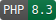

# Entra





Easily sign-in and poll users and groups in Microsoft Entra, built using [Laravel Microsoft Graph](https://github.com/dcblogdev/laravel-microsoft-graph). 

## Setup

1. Install this library using `Composer`:
   ```bash
   composer require networkrailbusinesssystems/entra
   ```
2. Publish the Entra configuration file using `Artisan`:
   ```bash
   php artisan vendor:publish --tag="entra"
   ```
3. Publish the MsGraph configuration file
   ```bash
   php artisan vendor:publish --provider="Dcblogdev\MsGraph\MsGraphServiceProvider" --tag="config"
   ```
   * You generally only need to set the `scopes` property
   * More information is available in the [Laravel Microsoft Graph](https://github.com/dcblogdev/laravel-microsoft-graph) documentation
4. Publish the MsGraph migration file
   ```bash
   php artisan vendor:publish --provider="Dcblogdev\MsGraph\MsGraphServiceProvider" --tag="migrations"
   ```
   * Consider adding a foreign key to the `user_id` column for greater efficiency
5. Adjust the `entra.php` configuration file to suit your needs
6. Setup your authenticatable User model
   * Implement the `EntraAuthenticatable` interface on your chosen Model
   * Add the `AuthenticatesWithEntra` trait on your chosen Model for a standard fetch and sync setup, or implement the methods yourself
7. Add the Entra authentication routes to your `routes/web.php` using the macro:
   ```php
   Route::entra();
   
   Route::middleware('MsGraphAuthenticated')->group(function () {
       // Your authenticated routes here...
   }
   ```

## Configuration

## create_users

Whether to allow Users without an account in the system already to sign-in.

When set to `true`, Entra will automatically create a new User record for anyone who successfully signs in.

When set to `false`, Users must be manually added before they can sign-in, even with a valid SSO session.

### messages

Customise any of the error messages thrown by Entra.

| Key           | Usage                                                                                  |
|---------------|----------------------------------------------------------------------------------------|
| existing_only | Shown when a new User attempts to log into a system with `create_users` set to `false` |


### sync_attributes

Any attributes set here will automatically be filled when signing in, keeping the User up to date with any changes in Entra.

The array should contain a key-value pair in `entra => laravel` format.

```php
'sync_attributes' => [
    'mail' => 'email',
],
```

### user_model

The fully qualified class name of the Model used for Laravel authentication.

```php
use App/Models/User;

'user_model' => User::class,
```

## Usage

Users will automatically be redirected to the Microsoft Azure login page whenever they attempt to access an authenticated route as a guest.

The `EntraServiceProvider` automatically registers the relevant event listeners for authentication.

You can use the `Laravel Microsoft Graph` library as normal.

### Entra helper

#### Entra::findGroup()

#### Entra::findGroups()

#### Entra::findUser()

#### Entra::findUsers()

#### Entra::importUser()

### Rules

#### UserExistsInDatabase

Ensure that the given User exists in the local database.

#### UserExistsInEntra

Ensure that the given User exists in Entra.

### Emulator

#### Entra::emulate()

#### Setting up emulated users

### Signing in and out

#### Automatic

If you wrap all of your system's endpoints in the `MsGraphAuthenticaed` middleware, Users will be automatically kicked to the Entra login page.

Should they become signed out for whatever reason, they will be kicked to the Entra login screen.

This may or may not be desirable based on how much of the system should be available to non-users.

#### Manual sign-in and out

You can allow users to manually login by providing a link to the `login` route, which will take them to the Entra login page.

Users can logout by calling the `logout` route, which will take them to the Entra logout page.

## Sample Entra responses

Sample responses are provided in the `tests/Data` directory.

## Help and support

You are welcome to raise any issues or questions on GitHub.

If you wish to contribute to this library, raise an issue before submitting a forked pull request.

## Licence

Published under the MIT licence.
